# device_systems API REST

## Descripción de la aplicación

device_systems es una API REST desarrollada con FastAPI para la gestión de usuarios. La aplicación permite listar usuarios, consultar usuarios por ID, filtrar usuarios por rol o estado y registrar nuevos usuarios utilizando validaciones con Pydantic.

---

# Tecnologías utilizadas

- Python
- FastAPI
- Uvicorn
- Pydantic v2
- Swagger UI

---

# Estructura del proyecto

```bash
device_systems/
│── app/
│   │── main.py
│   │
│   ├── schemas/
│   │   │── user_schema.py
│   │
│   ├── routes/
│   │   │── user_routes.py
│
│── requirements.txt
│── README.md
```

---

# Instalación de dependencias

## Crear entorno virtual

### Windows

```bash
python -m venv venv
venv\Scripts\activate
```

### Linux / Mac

```bash
python -m venv venv
source venv/bin/activate
```

---

## Instalar dependencias

```bash
pip install -r requirements.txt
```

---

# Archivo requirements.txt

```txt
fastapi
uvicorn
pydantic
email-validator
```

---

# Ejecución del servidor

```bash
python -m uvicorn app.main:app --reload
```

Abrir en el navegador:

```txt
http://127.0.0.1:8000/docs
```

---

# Tabla de endpoints

| Método | Endpoint | Descripción |
|---|---|---|
| GET | `/users` | Obtener todos los usuarios |
| GET | `/users/{user_id}` | Obtener usuario por ID |
| GET | `/users?role=admin` | Filtrar usuarios por rol |
| GET | `/users?is_active=true` | Filtrar usuarios activos |
| POST | `/users` | Registrar nuevo usuario |

---

# Ejemplos de peticiones GET y POST

## GET /users

```txt
GET http://127.0.0.1:8000/users
```

---

## GET /users/{user_id}

```txt
GET http://127.0.0.1:8000/users/1
```

---

## GET /users?role=admin

```txt
GET http://127.0.0.1:8000/users?role=admin
```

---

## GET /users?is_active=true

```txt
GET http://127.0.0.1:8000/users?is_active=true
```

---

## POST /users

```json
{
  "name": "Carlos Ruiz",
  "email": "carlos@example.com",
  "role": "user",
  "is_active": true
}
```

---

# Capturas de Swagger UI


<details>
<summary><b> Capturas GET/POST (Click para abrir)</b></summary>


## Captura 1 — Swagger UI funcionando

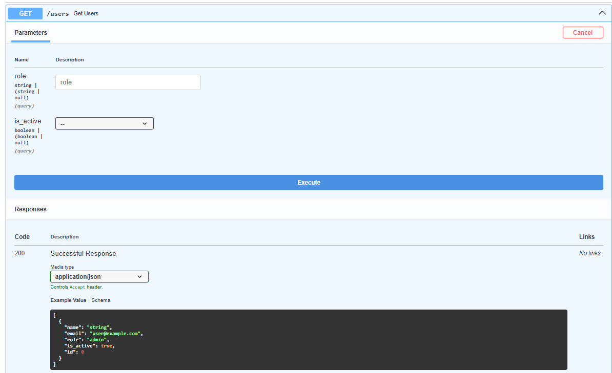
---

## Captura 2 — GET /users

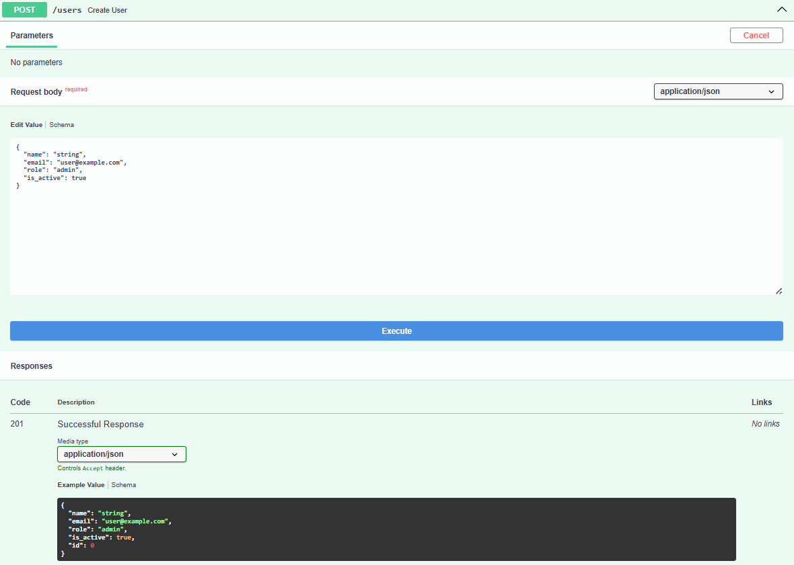
---

## Captura 3 — POST /users

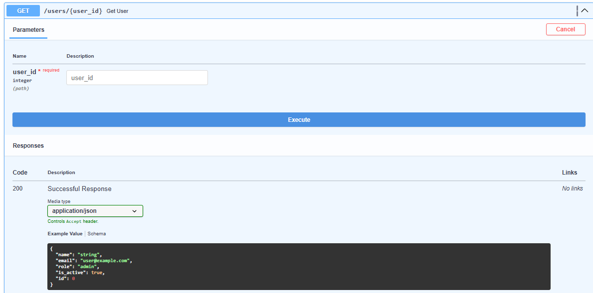
---

## Captura 3 - POST /Validacion Correo Repetido

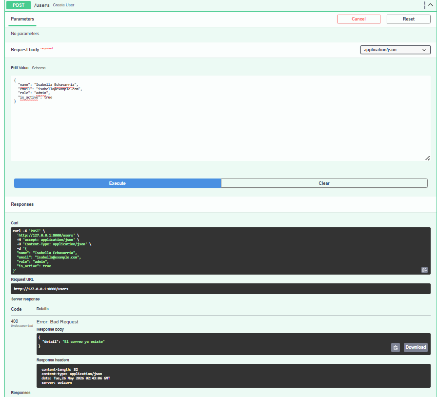
---

## Captura 4 — GET /users/{user_id}

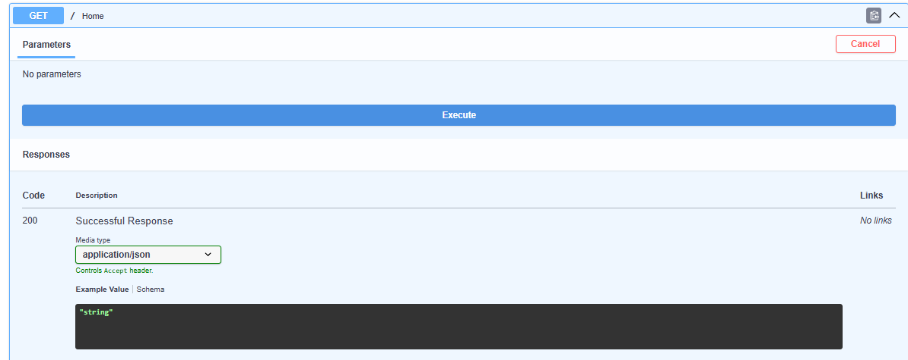

</details>

<details>
<summary><b> Capturas PUT/PACH/DELETE (Click para abrir)</b></summary>

## Captura 1 — PUT/users/{user_id}

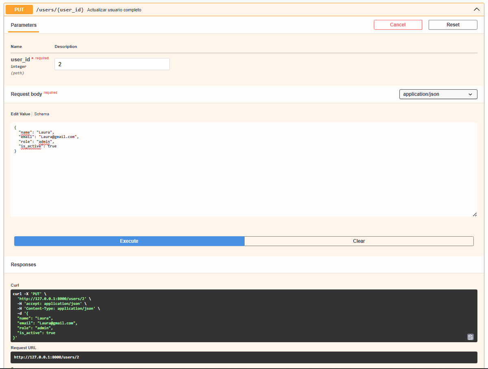


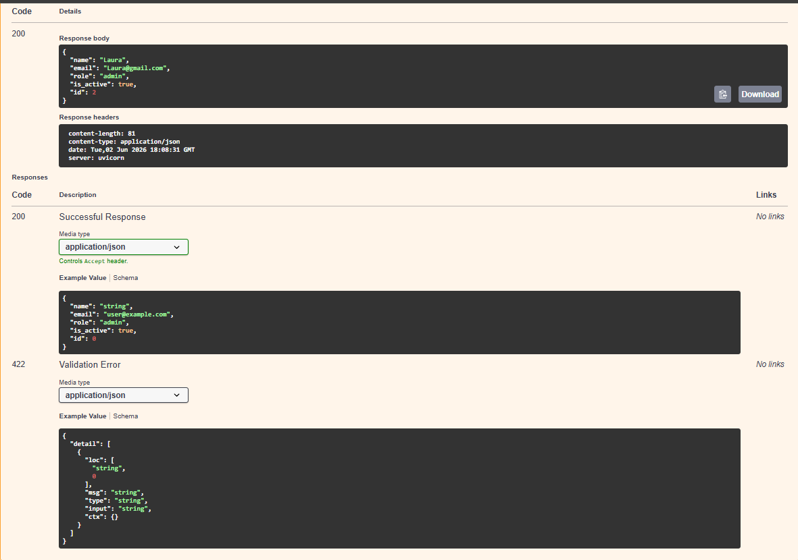

## Captura 1 - PUT Validacion Error


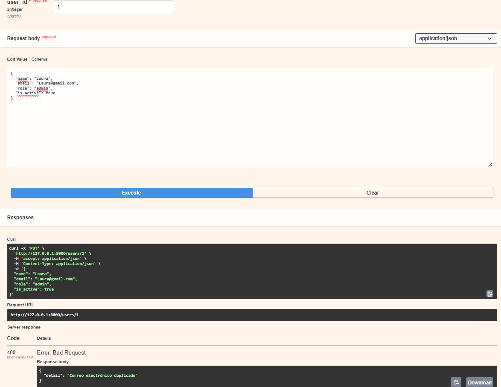
---

## Captura 2 - PATCH/users/{users_id}

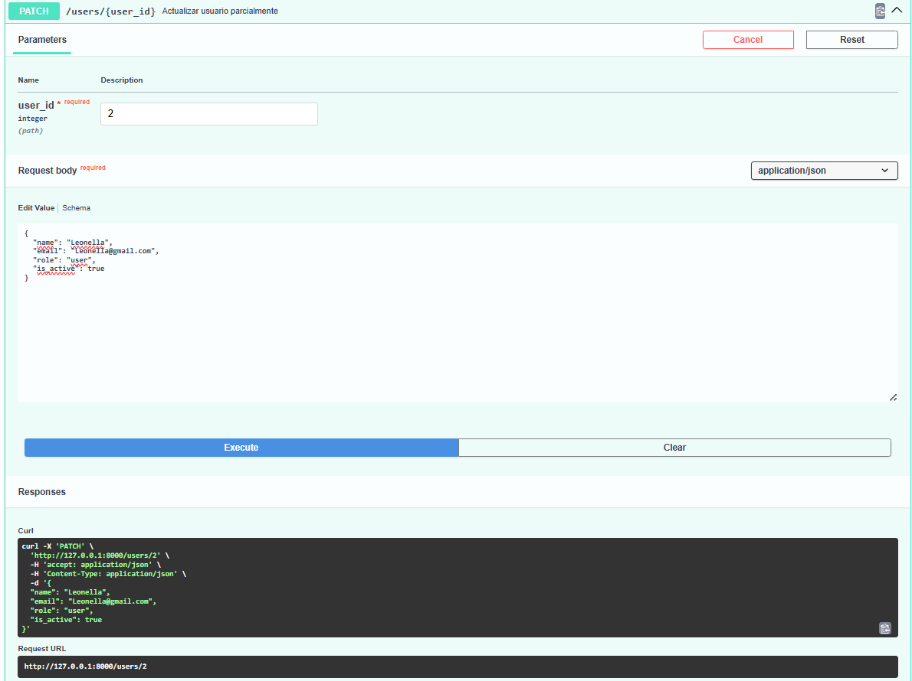
---

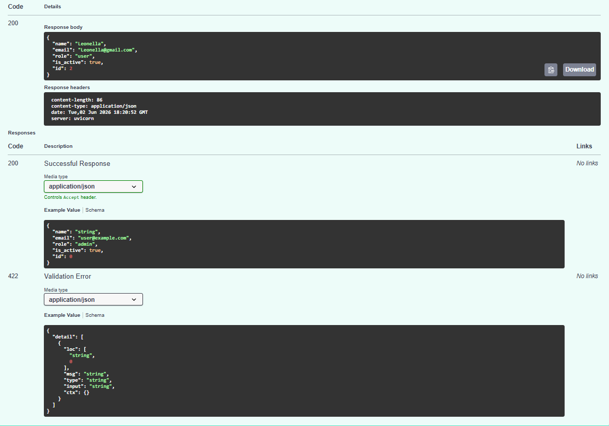
---

## Captura 2 - PATCH Validacion Error

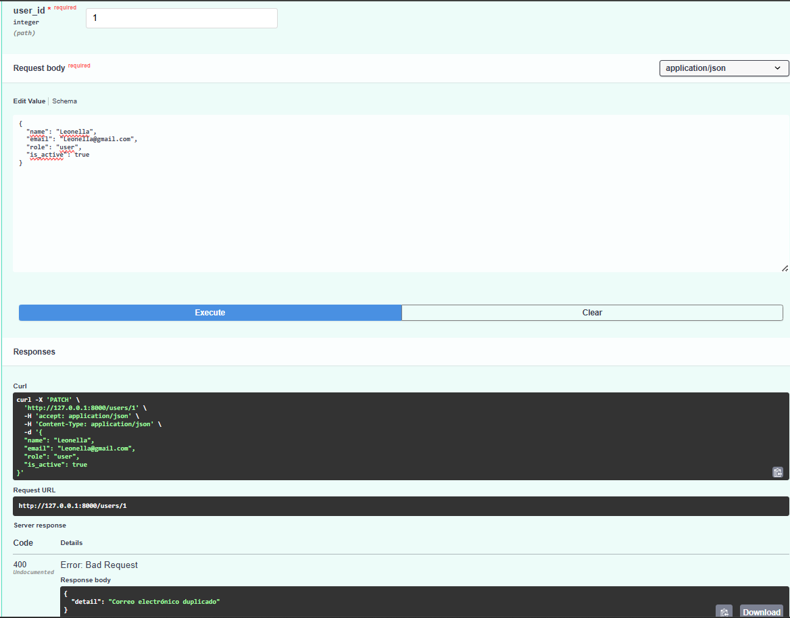
---

## Captura 3 - DELETE/users/{users_id}


---

## Captura 3 - DELETE Validacion Error


---

</details>


# Reflexión sobre FastAPI

FastAPI facilita el desarrollo de APIs REST gracias a su rapidez, validaciones automáticas y documentación integrada con Swagger UI. Durante el desarrollo se aprendió a trabajar con rutas, parámetros, validaciones con Pydantic y respuestas HTTP estructuradas de manera organizada.

# Presentacion de Video
[Ver video EV07](https://www.loom.com/share/19a31984ae5540718d48f6c05c179278)

---

# Explicación de la estructura del proyecto

Para mejorar la organización del código y facilitar el mantenimiento de la aplicación, el proyecto fue dividido en módulos con responsabilidades específicas.

```bash
device_systems/
│
├── app/
│   │── main.py
│   │
│   ├── routes/
│   │   │── user_routes.py
│   │
│   ├── schemas/
│   │   │── user_schema.py
│   │
│   ├── services/
│   │   │── user_service.py
│   │
│   ├── dependencies/
│   │   │── user_dependencies.py
│   │
│   └── data/
│       │── users_db.py
│
├── requirements.txt
├── README.md
└── .gitignore
```

## Organización de módulos

### routes

Contiene los endpoints de la API y la definición de las rutas disponibles para cada operación del recurso `users`.

### schemas

Incluye los modelos Pydantic utilizados para validar los datos recibidos y enviados por la API.

### services

Contiene la lógica de negocio de la aplicación, separando el procesamiento de datos de las rutas.

### dependencies

Almacena funciones reutilizables implementadas mediante Dependency Injection utilizando `Depends()`.

### data

Simula una base de datos en memoria donde se almacenan los usuarios registrados durante la ejecución de la aplicación.

### main.py

Actúa como punto de entrada principal de la API y contiene la configuración general de FastAPI.

---

# Implementación de Dependency Injection

La aplicación utiliza Dependency Injection mediante `Depends()` para reutilizar lógica común y evitar duplicación de código en los endpoints.

Se creó el archivo:

```bash
app/dependencies/user_dependencies.py
```

En este archivo se implementaron dependencias encargadas de validar la existencia de usuarios y controlar reglas de negocio antes de ejecutar las operaciones solicitadas.

Ejemplo de uso:

```python
user = Depends(get_user_or_404)
```

Gracias a este enfoque, las validaciones se centralizan en un único lugar, permitiendo que el código sea más limpio, reutilizable y fácil de mantener.

---

# Reflexión final sobre la evolución del proyecto

Durante el desarrollo de esta actividad se logró evolucionar la API inicial de usuarios hacia una solución más completa y profesional. Se implementó el CRUD completo mediante los métodos GET, POST, PUT, PATCH y DELETE, permitiendo realizar operaciones de consulta, creación, actualización y eliminación de usuarios.

Además, se incorporaron validaciones utilizando Pydantic, manejo de errores mediante HTTPException y códigos de estado HTTP adecuados para cada operación. También se mejoró la organización del proyecto mediante una estructura modular y la implementación de Dependency Injection para reutilizar lógica común.

Finalmente, la documentación automática generada por Swagger UI y ReDoc facilitó las pruebas de los endpoints y permitió contar con una API mejor documentada. Esta actividad permitió comprender la importancia de aplicar buenas prácticas en el desarrollo de APIs REST, mejorando la calidad, mantenibilidad y escalabilidad del proyecto.

---


[Ver Video EV08](https://www.loom.com/share/684ce3de85c74e13abfcdaf837d38786)

