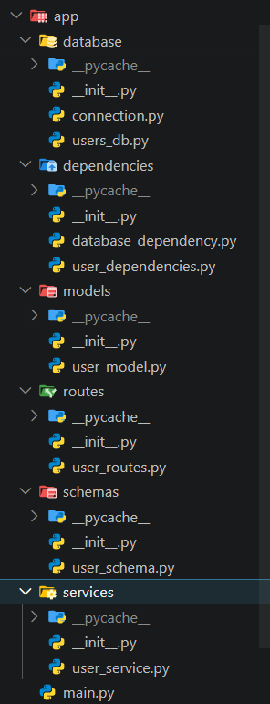
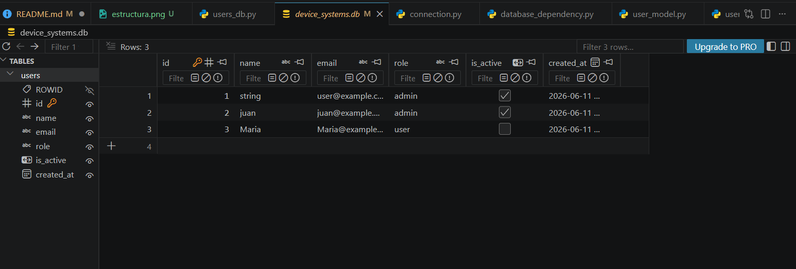
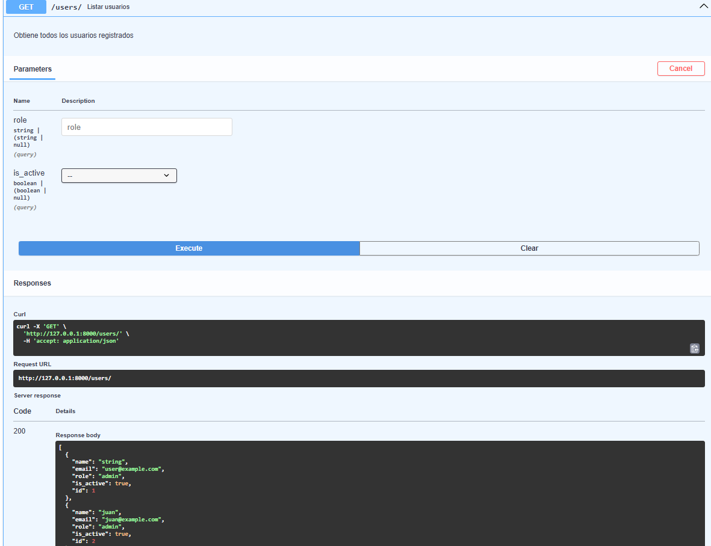
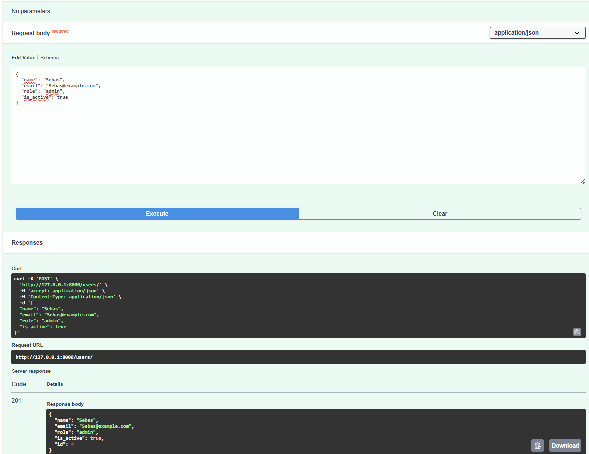
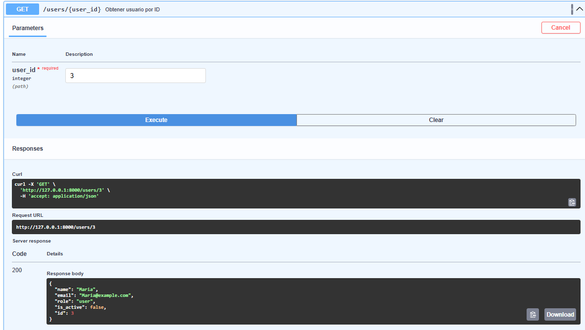
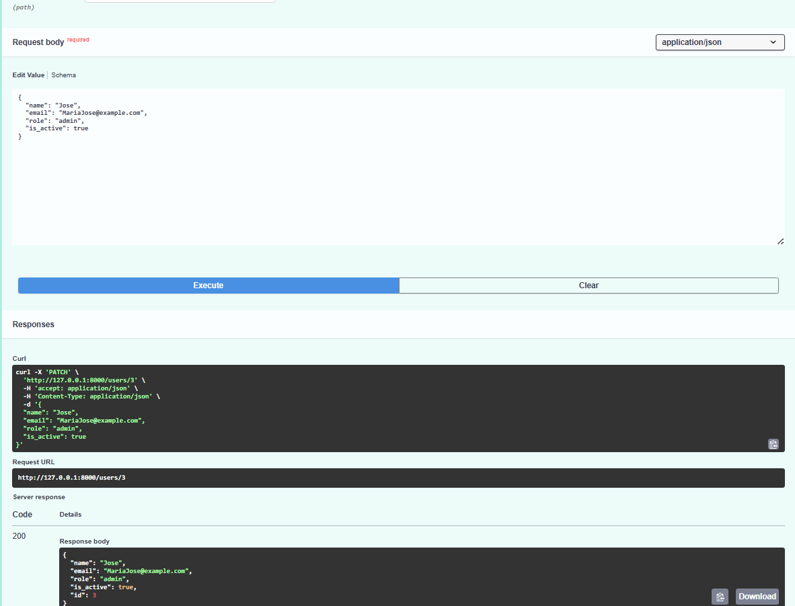
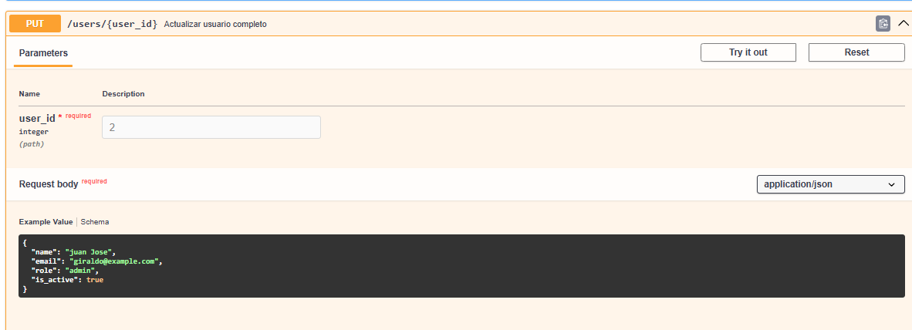
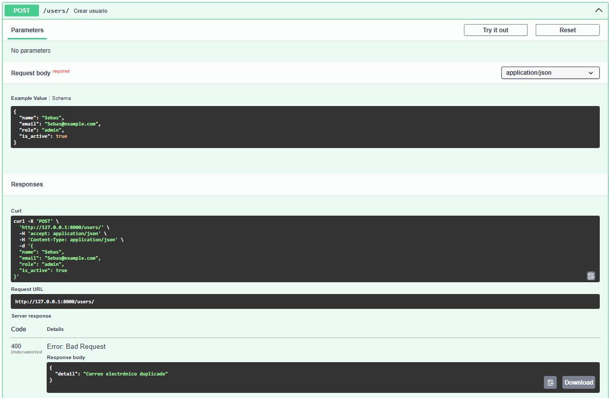
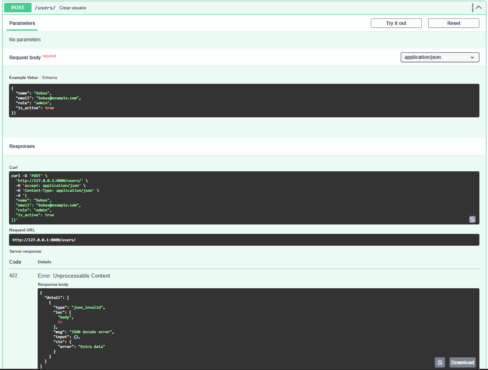

# device_systems API REST 

## Descripción de la aplicación

device_systems es una API REST desarrollada con FastAPI para la gestión de usuarios. La aplicación permite listar usuarios, consultar usuarios por ID, filtrar usuarios por rol o estado y registrar nuevos usuarios utilizando validaciones con Pydantic.

---

# Tecnologías utilizadas

- Python
- FastAPI
- Uvicorn
- Pydantic v2
- Swagger UI

---

# Estructura del proyecto EV08

```bash
device_systems/
│── app/
│   │── main.py
│   │
│   ├── schemas/
│   │   │── user_schema.py
│   │
│   ├── routes/
│   │   │── user_routes.py
│
│── requirements.txt
│── README.md
```

---

# Instalación de dependencias

## Crear entorno virtual

### Windows

```bash
python -m venv venv
venv\Scripts\activate
```

### Linux / Mac

```bash
python -m venv venv
source venv/bin/activate
```

---

## Instalar dependencias

```bash
pip install -r requirements.txt
```

---

# Archivo requirements.txt

```txt
fastapi
uvicorn
pydantic
email-validator
```

---

# Ejecución del servidor

```bash
python -m uvicorn app.main:app --reload
```

Abrir en el navegador:

```txt
http://127.0.0.1:8000/docs
```

---

# Tabla de endpoints

| Método | Endpoint | Descripción |
|---|---|---|
| GET | `/users` | Obtener todos los usuarios |
| GET | `/users/{user_id}` | Obtener usuario por ID |
| GET | `/users?role=admin` | Filtrar usuarios por rol |
| GET | `/users?is_active=true` | Filtrar usuarios activos |
| POST | `/users` | Registrar nuevo usuario |

---

# Ejemplos de peticiones GET y POST

## GET /users

```txt
GET http://127.0.0.1:8000/users
```

---

## GET /users/{user_id}

```txt
GET http://127.0.0.1:8000/users/1
```

---

## GET /users?role=admin

```txt
GET http://127.0.0.1:8000/users?role=admin
```

---

## GET /users?is_active=true

```txt
GET http://127.0.0.1:8000/users?is_active=true
```

---

## POST /users

```json
{
  "name": "Carlos Ruiz",
  "email": "carlos@example.com",
  "role": "user",
  "is_active": true
}
```

---

# Capturas de Swagger UI


<details>
<summary><b> Capturas GET/POST (Click para abrir)</b></summary>


## Captura 1 — Swagger UI funcionando


---

## Captura 2 — GET /users


---

## Captura 3 — POST /users


---

## Captura 3 - POST /Validacion Correo Repetido


---

## Captura 4 — GET /users/{user_id}


</details>

# Capturas Put/Patch/Delete

<details>
<summary><b> Capturas PUT/PACH/DELETE (Click para abrir)</b></summary>

## Captura 1 — PUT/users/{user_id}


## Captura 1 - PUT Validacion Error


---

## Captura 2 - PATCH/users/{users_id}


---


---

## Captura 2 - PATCH Validacion Error


---

## Captura 3 - DELETE/users/{users_id}


---

## Captura 3 - DELETE Validacion Error


---

</details>


# Reflexión sobre FastAPI

FastAPI facilita el desarrollo de APIs REST gracias a su rapidez, validaciones automáticas y documentación integrada con Swagger UI. Durante el desarrollo se aprendió a trabajar con rutas, parámetros, validaciones con Pydantic y respuestas HTTP estructuradas de manera organizada.

# Presentacion de Video
[Ver video EV07](https://www.loom.com/share/19a31984ae5540718d48f6c05c179278)

---

# Explicación de la estructura del proyecto

Para mejorar la organización del código y facilitar el mantenimiento de la aplicación, el proyecto fue dividido en módulos con responsabilidades específicas.

```bash
device_systems/
│
├── app/
│   │── main.py
│   │
│   ├── routes/
│   │   │── user_routes.py
│   │
│   ├── schemas/
│   │   │── user_schema.py
│   │
│   ├── services/
│   │   │── user_service.py
│   │
│   ├── dependencies/
│   │   │── user_dependencies.py
│   │
│   └── data/
│       │── users_db.py
│
├── requirements.txt
├── README.md
└── .gitignore
```

## Organización de módulos

### routes

Contiene los endpoints de la API y la definición de las rutas disponibles para cada operación del recurso `users`.

### schemas

Incluye los modelos Pydantic utilizados para validar los datos recibidos y enviados por la API.

### services

Contiene la lógica de negocio de la aplicación, separando el procesamiento de datos de las rutas.

### dependencies

Almacena funciones reutilizables implementadas mediante Dependency Injection utilizando `Depends()`.

### data

Simula una base de datos en memoria donde se almacenan los usuarios registrados durante la ejecución de la aplicación.

### main.py

Actúa como punto de entrada principal de la API y contiene la configuración general de FastAPI.

---

# Implementación de Dependency Injection

La aplicación utiliza Dependency Injection mediante `Depends()` para reutilizar lógica común y evitar duplicación de código en los endpoints.

Se creó el archivo:

```bash
app/dependencies/user_dependencies.py
```

En este archivo se implementaron dependencias encargadas de validar la existencia de usuarios y controlar reglas de negocio antes de ejecutar las operaciones solicitadas.

Ejemplo de uso:

```python
user = Depends(get_user_or_404)
```

Gracias a este enfoque, las validaciones se centralizan en un único lugar, permitiendo que el código sea más limpio, reutilizable y fácil de mantener.

---

# Reflexión final sobre la evolución del proyecto

Durante el desarrollo de esta actividad se logró evolucionar la API inicial de usuarios hacia una solución más completa y profesional. Se implementó el CRUD completo mediante los métodos GET, POST, PUT, PATCH y DELETE, permitiendo realizar operaciones de consulta, creación, actualización y eliminación de usuarios.

Además, se incorporaron validaciones utilizando Pydantic, manejo de errores mediante HTTPException y códigos de estado HTTP adecuados para cada operación. También se mejoró la organización del proyecto mediante una estructura modular y la implementación de Dependency Injection para reutilizar lógica común.

Finalmente, la documentación automática generada por Swagger UI y ReDoc facilitó las pruebas de los endpoints y permitió contar con una API mejor documentada. Esta actividad permitió comprender la importancia de aplicar buenas prácticas en el desarrollo de APIs REST, mejorando la calidad, mantenibilidad y escalabilidad del proyecto.

---

# Video EV08

[Ver Video EV08](https://www.loom.com/share/684ce3de85c74e13abfcdaf837d38786)

# Explicacion de la estructura del proyecto EV09

el objetivo fue que el recurso "users" que se gestionaba en la memoria mediante listas o estructuras temporales, en esta nueva version transformaremos la API para que los usuarios se almacenen, consulten, actualicen y eliminen desde una base de datos usando modelos SQLAlchemy, schemas Pydantic, validaciones, constraints y operaciones CRUD


```bash

├── app/
│   main.py
│   
├───database
│   │   connection.py
│   │   users_db.py
│   │   __init__.py
│   │   
│   └───__pycache__
│           connection.cpython-314.pyc
│           users_db.cpython-314.pyc
│           __init__.cpython-314.pyc
│           
├───dependencies
│   │   database_dependency.py
│   │   user_dependencies.py
│   │   __init__.py
│   │   
│   └───__pycache__
│           database_dependency.cpython-314.pyc
│           user_dependencies.cpython-314.pyc
│           __init__.cpython-314.pyc
│           
├───models
│   │   user_model.py
│   │   __init__.py
│   │   
│   └───__pycache__
│           user_model.cpython-314.pyc
│           __init__.cpython-314.pyc
│           
├───routes
│   │   user_routes.py
│   │   __init__.py
│   │   
│   └───__pycache__
│           user_routes.cpython-314.pyc
│           __init__.cpython-314.pyc
│           
├───schemas
│   │   user_schema.py
│   │   __init__.py
│   │   
│   └───__pycache__
│           user_schema.cpython-314.pyc
│           __init__.cpython-314.pyc
│           
├───services
│   │   user_service.py
│   │   __init__.py
│   │   
│   └───__pycache__
│           user_service.cpython-314.pyc
│           __init__.cpython-314.pyc
│           
└───__pycache__
        main.cpython-314.pyc

```

# Evidencias

<details>
<summary><b> Base Datos + Swagger(Click para abrir)</b></summary>


## Captura 1 — Estructura de archivos


---

## Captura 2 — Base de Datos


---

## Captura 3 — Get/users/


---

## Captura 4 — Post/users/ 


---

## Captura 5 — Get/users/{users_id}


---

## Captura  6 — Patch/users/{users_id}


---

## Captura  7 — Delete/users/{users_id}


---

## Captura  8 — Error correo duplicado (400)


---

## Captura  9 — Datos invalidos (422)


---

</details>

##  Diferencia entre SQLAlchemy Model y Pydantic Schema

| Aspecto | SQLAlchemy (Model) | Pydantic (Schema) |
|---------|--------------------|--------------------|
| **Qué hace** | Define la estructura de la tabla en BD | Valida los datos que entran/salen por la API |
| **Dónde vive** | En la base de datos (disco duro) | En la memoria RAM (solo durante la petición) |
| **Ejemplo real** | email = Column(String, unique=True) | email: EmailStr |
| **Validación** | Solo tipos básicos (String, Integer) | Reglas complejas (email, longitud, valores permitidos) |
| **Persistencia** |  Los datos se guardan permanentemente |  Los datos se pierden si no se guardan |

### En tu código:

- **`user_model.py`** → SQLAlchemy: le dice a la BD cómo crear la tabla `users`
- **`user_schema.py`** → Pydantic: valida que el email sea válido y el nombre tenga al menos 3 caracteres


---

##  Reflexión: Importancia de la persistencia

### ¿Qué pasaría sin persistencia?

| Situación | Sin persistencia | Con persistencia (tu API) |
|-----------|------------------|---------------------------|
| Reinicias el servidor |  Se pierden todos los usuarios |  Los usuarios siguen ahí |
| Dos clientes consultan |  Cada uno ve datos diferentes |  Todos ven los mismos datos |
| Quieres saber cuándo se creó un usuario |  No es posible |  El campo `created_at` lo guarda |

# Video EV09

[Ver Video EV09]()

# Explicación de la estructura del proyecto EV10

##  Descripción del Proyecto

API REST para gestión de usuarios, dispositivos y préstamos, desarrollada con FastAPI. Esta versión implementa migraciones con Alembic, asociaciones entre modelos (User, Device, Loan) y consultas con joins para obtener información relacionada.

##  Tecnologías Utilizadas

- FastAPI
- SQLAlchemy
- Alembic
- Pydantic
- SQLite
- Uvicorn

##  Estructura del Proyecto

```bash

device_systems/
│
├── app/
│   │   main.py
│   │
│   ├───database/
│   │   │   connection.py
│   │   │   users_db.py
│   │   │   __init__.py
│   │   │
│   │   └───__pycache__/
│   │           connection.cpython-314.pyc
│   │           users_db.cpython-314.pyc
│   │           __init__.cpython-314.pyc
│   │
│   ├───dependencies/
│   │   │   database_dependency.py
│   │   │   user_dependencies.py
│   │   │   __init__.py
│   │   │
│   │   └───__pycache__/
│   │           database_dependency.cpython-314.pyc
│   │           user_dependencies.cpython-314.pyc
│   │           __init__.cpython-314.pyc
│   │
│   ├───models/
│   │   │   user_model.py
│   │   │   device_model.py
│   │   │   loan_model.py
│   │   │   __init__.py
│   │   │
│   │   └───__pycache__/
│   │           user_model.cpython-314.pyc
│   │           device_model.cpython-314.pyc
│   │           loan_model.cpython-314.pyc
│   │           __init__.cpython-314.pyc
│   │
│   ├───routes/
│   │   │   user_routes.py
│   │   │   device_routes.py
│   │   │   loan_routes.py
│   │   │   __init__.py
│   │   │
│   │   └───__pycache__/
│   │           user_routes.cpython-314.pyc
│   │           device_routes.cpython-314.pyc
│   │           loan_routes.cpython-314.pyc
│   │           __init__.cpython-314.pyc
│   │
│   ├───schemas/
│   │   │   user_schema.py
│   │   │   device_schema.py
│   │   │   loan_schema.py
│   │   │   __init__.py
│   │   │
│   │   └───__pycache__/
│   │           user_schema.cpython-314.pyc
│   │           device_schema.cpython-314.pyc
│   │           loan_schema.cpython-314.pyc
│   │           __init__.cpython-314.pyc
│   │
│   ├───services/
│   │   │   user_service.py
│   │   │   device_service.py
│   │   │   loan_service.py
│   │   │   __init__.py
│   │   │
│   │   └───__pycache__/
│   │           user_service.cpython-314.pyc
│   │           device_service.cpython-314.pyc
│   │           loan_service.cpython-314.pyc
│   │           __init__.cpython-314.pyc
│   │
│   └───__pycache__/
│           main.cpython-314.pyc
│
├───alembic/
│   │
│   └───versions/
│           └─── 4df4a28f13b7_initial_migration_with_users_devices_.py
│   │
│   │   __init__.py
│   │   env.py
│   │   script.py.mako
│   │
│   └───__pycache__/
│
├───images/
│
├───venv/
│
├── .env
├── .env.example
├── .gitignore
├── alembic.ini
├── device_systems.db
├── requirements.txt
└── README.md
```

##  Instalación

# Crear entorno virtual
python -m venv venv

# Instalar dependencias
pip install -r requirements.txt

# Aplicar migraciones
alembic upgrade head

# Ejecutar servidor
uvicorn app.main:app --reload

##  Endpoints

### Users

| Método | Endpoint | Descripción |
|--------|----------|-------------|
| GET | /users | Listar usuarios |
| GET | /users/{id} | Obtener usuario por ID |
| POST | /users | Crear usuario |
| PUT | /users/{id} | Actualizar usuario completo |
| PATCH | /users/{id} | Actualizar usuario parcialmente |
| DELETE | /users/{id} | Eliminar usuario |

### Devices

| Método | Endpoint | Descripción |
|--------|----------|-------------|
| GET | /devices | Listar dispositivos |
| GET | /devices/{id} | Obtener dispositivo por ID |
| POST | /devices | Crear dispositivo |
| PUT | /devices/{id} | Actualizar dispositivo completo |
| PATCH | /devices/{id} | Actualizar dispositivo parcialmente |
| DELETE | /devices/{id} | Eliminar dispositivo |

### Loans

| Método | Endpoint | Descripción |
|--------|----------|-------------|
| GET | /loans | Listar préstamos |
| GET | /loans/details | Listar préstamos con JOIN |
| GET | /loans/{id} | Obtener préstamo por ID |
| GET | /loans/user/{id} | Préstamos de un usuario |
| GET | /loans/device/{id} | Préstamos de un dispositivo |
| POST | /loans | Crear préstamo |
| PATCH | /loans/{id}/return | Devolver dispositivo |
| PATCH | /loans/{id} | Actualizar préstamo |
| DELETE | /loans/{id} | Eliminar préstamo |

##  Consultas con JOIN - /loans/details

Ejemplo de respuesta:

{
  "id": 1,
  "status": "active",
  "loan_date": "2024-06-18T10:00:00",
  "user": {
    "id": 1,
    "name": "Juan Perez",
    "email": "juan@test.com"
  },

  "device": {
    "id": 1,
    "name": "Laptop HP",
    "serial_number": "HP-001",
    "device_type": "laptop"
  }
}

##  Migraciones con Alembic

# Generar migración
alembic revision --autogenerate -m "mensaje"

# Aplicar migración
alembic upgrade head

# Ver historial
alembic history

# Ver estado actual
alembic current

##  Evidencias

- Swagger UI con endpoints Users, Devices, Loans
- Creación de usuario, dispositivo y préstamo
- GET /loans/details con información JOIN
- Historial de migraciones
- Base de datos con tablas creadas

### ¿Qué se logró con esta actividad?

1. Migraciones con Alembic: Control de versiones de la base de datos, permitiendo cambios estructurados y reversibles.

2. Asociaciones entre modelos: Relaciones One-to-Many entre User-Loan y Device-Loan, garantizando integridad referencial.

3. Consultas con JOIN: Obtención de información relacionada en una sola consulta, mejorando el rendimiento.

4. Arquitectura por capas: Separación clara entre modelos, schemas, servicios y rutas.

5. API REST completa: CRUD completo para Users, Devices y Loans.
